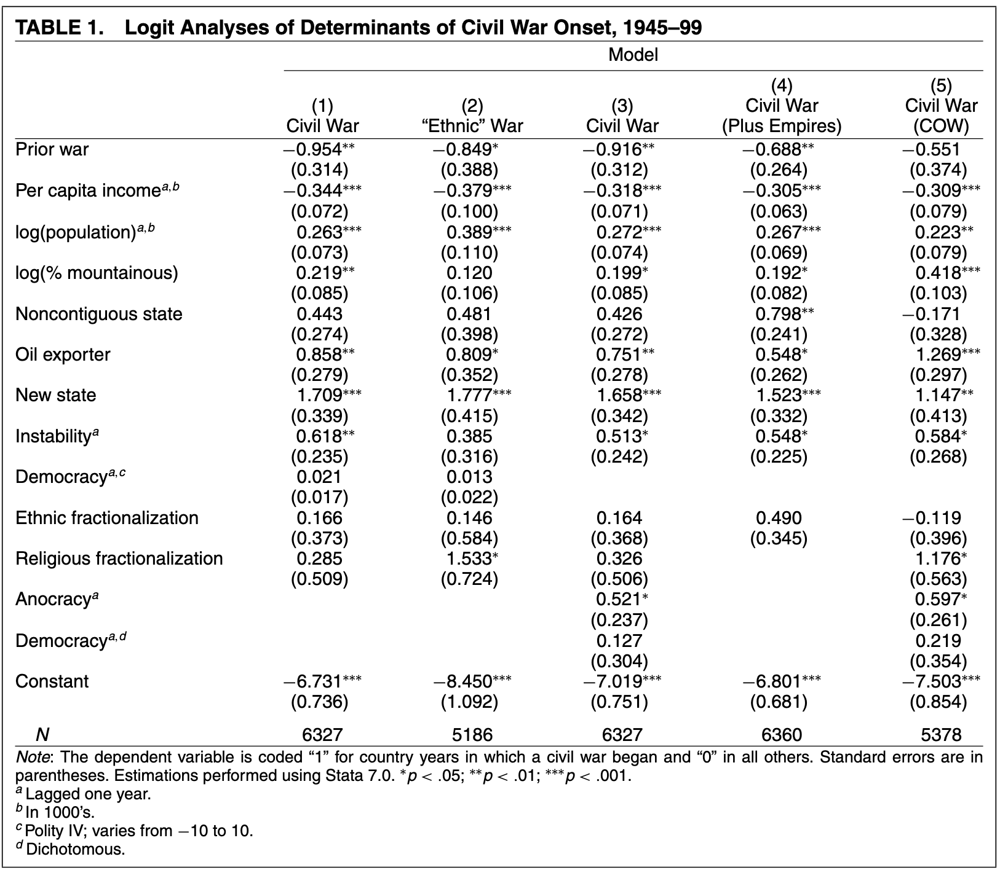
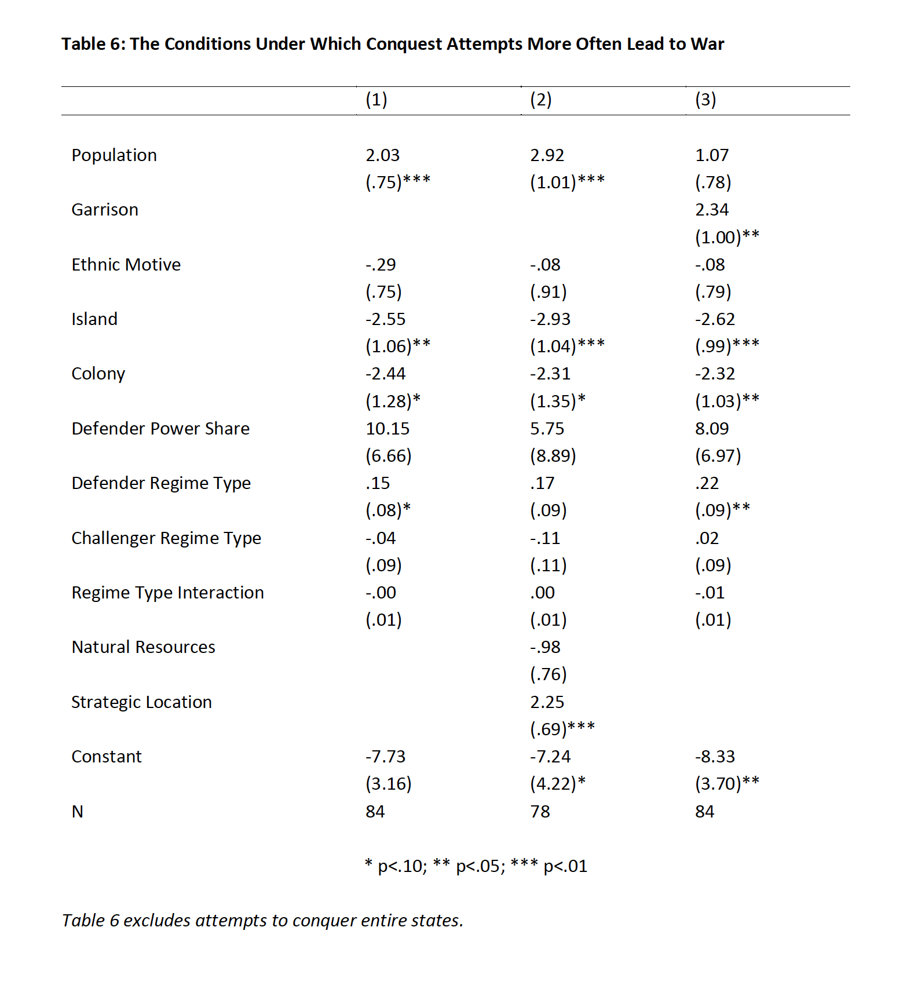
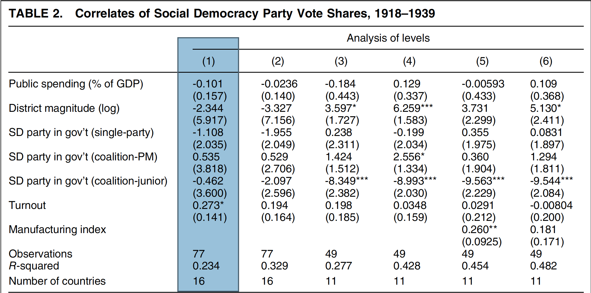

    
    ```{r setup, include=FALSE, message=F, warning=F}
knitr::opts_chunk$set(echo = FALSE)
library(broom)
library(estimatr)
library(fabricatr)
library(haven)
library(here)
library(lmtest)
library(randomizr)
library(sandwich)
library(texreg)
library(tidyverse)
```

# Owls and Apologies 

.center[
```{r, out.height='400px', out.width = '500px'}
knitr::include_graphics("img/owl.jpg")
```
]

---

# Learning Objectives 

By the end of this workshop we will hopefully have learned:
    
--
    
1. General Principles of Data Wrangling 

--
    
2. Basic, but powerful, tools for reshaping data  

--

3. How to apply these principles on actual research projects (plus heteroskedastic error corrections!)

---
    
# What packages do I need to follow along 
    
This talk is completely in **R**. 

We will spend our time using functions from the following packages: 

`tidyverse`: The absolute workhorse king for data wrangling in R 

`haven`: The best way to read in Stata files to R 

`estimatr`: The easiest way to get HC* error corrections 

`lmtest`: For when estimatr fails us. 

---

# Data Wrangling 

Working with data means answering three questions 

--

What do we want to do?

--

How do we instruct a computer to do that thing?

--

How do we execute that thing in a reasonable amount of time?

---

# Tidy Data

A way to help us get started is to constrain our data to be tidy

Tidy data means: 

  - Each Variable is saved in its own column 
  - Each Observation is saved in its own row 
  - Each Cell is a single value 

Tidy data makes the analysis of data **much** easier for you and for your future self

---

# The Verbs of Data Wrangling 

Data Wrangling has a few major "verbs". The most common ones in every day data analysis are: 

`arrange()`: Order observations according to a condition. 

`filter()`: Pick observations and variables of interest.

`group_by()`: Organize observations into groups of observations

`mutate()`: Make a new variable or change an existing variable according to a condition

`select()`: Include or exclude a variable of interest. 

`summarise()`: Get a summary of a variable 

`pivot`: Change the shape of of a dataset. 
---

# Reshaping Untidy Data Example 1

Suppose we have the following data, based on the standard format of the World Bank WDI 

```{r, eval = T}
ex1_w <- data.frame(
  country = c("USA", "Mexico"),
  y2010 = c(100, 90),
  y2011 = c(85, 95),
  y2012 = c(NA_real_, 99)
)

ex1_w
```

This data frame is an example of *wide* data. There are more columns than rows. 

For almost everything we do in R, we prefer *long* data. 
---

# Reshaping our Untidy data set 

The tidyverse package to reshape data is called tidyr. 

The key functions are `pivot_longer()` and `pivot_wider()`. `pivot_longer()` converts wide data to long. `pivot_wider()` does the reverse. 

--
```{r, echo = T}
ex1_l <- ex1_w %>% 
  pivot_longer(-country, names_to = "year", values_to = "count")%>%
  mutate(year = str_replace_all(year, "y", "")%>%
           trimws()%>%
           as.integer()) #<<

ex1_l
```

---

# Reshaping Data Example 2 

Sometimes our data was made by evil people who put multiple pieces of information in a column name. 

```{r}

ex2_w <- data.frame(
    country = c("USA", "Mexico"),
    year = c(2010, 2010),
    employ_r_1519 = c(50, 60),
    unemploy_r_1519 = c(45, 50),
    retire_r_1519 = c(70, 80), 
    check.names = F
)
ex2_w


```

Here, the authors of this dataset include the type of employment and age in the same variable name. 

---

# Fix Untidy Data 2 

Our basic structure remains the same. Here we use two tricks to grab columns faster. 

We can specify the columns we want to pivot with `cols`. 

We can use `names_sep` to split up a column name. 

```{r, echo=T}
ex2_l <- ex2_w %>% 
  pivot_longer(cols = employ_r_1519:retire_r_1519, #<<
               names_to = c("status","type", "age"),
               names_sep = "_",
               values_to = "value")
```

```{r, echo = F}
ex2_l
```
---

# Wrangling Incorrect Data

Data Entry is fraught with challenges. As an example consider Fearon and Laitin 2003. 

.center[
```{r, out.height='400px', out.width = '500px'}

```
]

Focus on Model 1 of this table. 

---

# A Failed Replication
```{r, echo = T}
# Replication file for Fearon and Laitin 2003 
fearon <- read_dta(here("Workshop1/data/fearon.dta"))

# Main model specification 


tryCatch({f1 <- glm(onset ~ warl + gdpenl + lpopl1 + lmtnest + 
                      ncontig + Oil + nwstate + instab + polity2l +
                      ethfrac + relfrac, 
                    data = fearon, 
                    family = "binomial")}, 
         error = function(e){ 
           print("Replication fail due to y greater than 1")
           })

```

---

# Examining the Error 

Fearon and Laitin's data fails to replicate because of a bad data entry. 

```{r, eval = T}
fearon %>% 
  select(onset)%>%
  summary()

```

The problem entry is Russia 1946

```{r, echo = T}
fearon %>% 
  filter(onset == 4)%>% 
  select(country, year, onset)
```
---

# Fixing The Error 

```{r,echo=T}
fearon <- fearon %>%
  mutate(onset = case_when(
    onset == 4~1,
    TRUE~onset))

# Now this will work 
f1 <- glm(onset ~ warl + gdpenl + lpopl1 + lmtnest + 
            ncontig + Oil + nwstate + instab + polity2l + 
            ethfrac + relfrac, data = fearon, family = "binomial")
tidy(f1)
```

---
class: center, middle 
# Using the Verbs in a real analysis 

The first demonstration of a basic workflow with our verbs is a replication of Daniel Altman's "The Evolution of Territorial Conquest after 1945 and the Limits of the Norm of Territorial Integrity"

.center[
```{r, out.height='450px', out.width = '400px'}

```
]

---

# Replicating Altman 2020  

We will do it as a coefficient plot 
.center[
```{r, echo = F, message=F, warning = F, out.width='500px'}
# Load Data 

## Use read_dta() from haven to import .dta file 
conquest <- read_dta(here("Workshop1/data/altman.dta"))

## Generate variables used in regression specifications 

data <- conquest %>% 
    mutate(logmilex = log(milex),
           logmilexchal = log(milexadv),
           logmilexshare = logmilex / (logmilexchal + logmilex),
           rspolity2 = polity2 + 10, 
           rspolity2adv = polity2adv + 10, 
           rspolity2int = rspolity2 * rspolity2adv)%>%
    filter(entire != 1, 
           retaliatory != 1)

# Fit Models 

## Logistic Model Fit for Model 1 
m1 <- glm(cowwar ~ popul + ethnic + island + colony + logmilexshare + rspolity2 + rspolity2adv + rspolity2int, data = data, family = "binomial")

##  Replicate clustered stata errors 
o1 <- coeftest(m1, vcov. = vcovCL(m1, type = "HC0", cluster = data$confnum))%>%
    tidy()%>%
    mutate(model = "Model 1")

## Logistic Model Fit for Model 2
m2 <- glm(cowwar ~ popul + ethnic + island + colony + logmilexshare + rspolity2 + rspolity2adv + rspolity2int + tcresource + tcstratloc, data = data, family = "binomial")

## Replicate clustered stata errors 
o2 <- coeftest(m2, vcov. = vcovCL(m2, type = "HC0", cluster = data$confnum))%>%
    tidy()%>%
    mutate(model = "Model 2")

## Logistic Model Fit for Model 3
m3 <- glm(cowwar ~ popul + garrison + ethnic + island + colony + logmilexshare + rspolity2 + rspolity2adv + rspolity2int, data = data, family = "binomial")

## Replicate clustered stata errors 
o3 <- coeftest(m3, vcov. = vcovCL(m3, type = "HC0", cluster = data$confnum))%>%
    tidy()%>%
    mutate(model = "Model 3")

## Bind Results into a single data frame 
results <- bind_rows(list(o1,o2,o3))%>%
    mutate(conf.low = estimate - std.error,
           conf.high = estimate + std.error)


# Visualize Results 
results_plot <- results %>%
    # We don't need the intercept so filter it out 
    filter(term != "(Intercept)")%>%
    # Not necessary but done to match Altman paper
    mutate(term = factor(term, levels = c("tcstratloc", "tcresource", "rspolity2int", "rspolity2adv", "rspolity2", "logmilexshare","colony", "island", "ethnic","garrison",  "popul")))%>%
    # Coefficient Plot Graph 
    ggplot(.,aes(x = term, y = estimate, group = model))+
    geom_point()+
    geom_pointrange(aes(ymin = conf.low, ymax = conf.high))+
    scale_x_discrete(labels = c("Strategic Location", "Natural Resources", "Regime Type Interaction", "Challenger Regime Type", "Defender Regime Type" , "Defender Power Share", "Colony", "Island", "Ethnic Motive", "Garrison", "Population"))+
    coord_flip()+
    facet_wrap(~model)+
    ylim(-15,15)+
    ylab("")+
    xlab("")+
    theme_classic()+
  labs(title = "The Conditions Under Which Conquest Attempts\n More Often Lead to War", subtitle = "Table 6", caption = "Altman 2020")

results_plot
```
]
---
    
# Step 1: Read in Data 
    
We use haven::read_dta() to read in STATA files. 

```{r, echo = T, eval = F}
## Use read_dta() from haven to import .dta file 
conquest <- read_dta(here("Conquest REP.dta"))

```

---
    
# Step 2: Wrangle Data 
    
Using mutate(), we apply a log scale to two variables, recode two variables, and create two new variables. 

Note the filter() command to subset to just the rows where entire == 0 and retaliatory == 0. 

```{r, echo = T, eval = F}
## Generate variables used in regression specifications 

data <- conquest %>% 
    mutate(logmilex = log(milex),
           logmilexchal = log(milexadv),
           logmilexshare = logmilex / (logmilexchal + logmilex),
           rspolity2 = polity2 + 10, 
           rspolity2adv = polity2adv + 10, 
           rspolity2int = rspolity2 * rspolity2adv)%>%
    filter(entire == 0, #<<
           retaliatory == 0) #<<
```

---
    
# Step 3: Fit Models 
    
We will fit three models. For exposition, here is the first model. 

```{r, eval = F, echo = T}
## Logistic Model Fit for Model 1 
m1 <- glm(cowwar ~ popul + ethnic + island + colony + 
            logmilexshare + rspolity2 + rspolity2adv + 
            rspolity2int, 
          data = data, 
          family = "binomial")

##  Replicate clustered stata errors 
o1 <- coeftest(m1, #<<
               vcov. = vcovCL(m1, #<<
                              type = "HC0", #<<
                              cluster = data$confnum))%>% #<<
    tidy()%>%
    mutate(model = "Model 1")

```

The highlighted code is the R implementation of Stata's cluster() command for logistic models

---

# Step 3: Fit Models 

For output, we want to put our models into one data frame. 

```{r, echo = T, eval = F}
## Bind Results into a single data frame 
results <- bind_rows(list(o1,o2,o3))%>%
  mutate(conf.low = estimate - std.error,
         conf.high = estimate + std.error) %>%
  # We don't need the intercept so filter it out 
filter(term != "(Intercept)")%>%
    # Not a necessary step. The following is done to match Altman paper
    mutate(term = factor(term, 
                         levels = c("tcstratloc", "tcresource",
                                    "rspolity2int", "rspolity2adv", 
                                    "rspolity2", "logmilexshare",
                                    "colony", "island",
                                    "ethnic","garrison",
                                    "popul")))
```

---
    
# Step 4: Report Results 
    
I'm partial to graphs whenever possible. What follows is example ggplot2 code. 

```{r, echo = T, eval = F}
 ggplot(results, aes(x = term, y = estimate, group = model))+
  geom_point()+
  geom_pointrange(aes(ymin = conf.low, ymax = conf.high))+
  scale_x_discrete(labels = c("Strategic Location", 
                              "Natural Resources", 
                              "Regime Type Interaction", 
                              "Challenger Regime Type",
                              "Defender Regime Type", 
                              "Defender Power Share", 
                              "Colony", "Island", 
                              "Ethnic Motive", "Garrison",
                              "Population"))+
  coord_flip()+
  facet_wrap(~model)+
  ylim(-15,15)+
  ylab("")+
  xlab("")+
  theme_classic()+
  labs(title = "Conditions Under Which Conquest Attempts More Often Lead to War", 
       subtitle = "Table 6", 
       caption = "Altman 2020")
```

---

# Part 2: Robust SEs In R the Easy Way

---

# Robust SEs (Conceptual)

Standard Errors are always wrong

Your data never has errors distributed with a constant variance 

There is practically never any harm in assuming that the errors are not distributed with a constant variance 

Everyone is going to ask to see your regressions with heteroskedastic consistent standard errors. 

---

# Robust SEs in R 

Base R does not compute HC errors by default. This means that we require additional packages. 

  - Yes, this is annoying. 
  - Yes, it used to be easier to do this in Stata than in R
  
Fortunately, the `estimatr` package more or less solves all of your problems if you are using OLS as an estimation strategy

---
# Conceptual Example 

Imagine we are running an experiment of 1000 people with a pre-treatment covariate x, which represents a pre-test score

```{r, echo = F,eval=T}
set.seed(42)
fake_data <- fabricate(
  N = 1000, # sample size
  x = runif(N, 0,1),
  y0 = x + rnorm(N, 0, 1),
  y1 = y0 + 1, # constant treatment potential outcome of 1
  treat_indicator = complete_ra(N), # complete random assignment to treatment
  y = ifelse(treat_indicator, y1, y0)
)

```

```{r}
head(fake_data)
```

---

# Conceptual Example Continued 

the estimatr packages provides `lm_robust()` to fit linear models with heteroskedastic standard errors. 

```{r, echo = T, eval = F}
lm_vanilla <- lm_robust(y~treat_indicator + x, data = fake_data, se_type = "HC0")

lm_stata <- lm_robust(y~treat_indicator + x, data = fake_data, se_type = "stata")

```

You can even easily replicate stata errors with a single argument option 

---

# Conceptual Example Continued 

```{r, results="asis"}
lm_vanilla <- lm_robust(y~treat_indicator + x, data = fake_data, se_type = "HC0")

lm_stata <- lm_robust(y~treat_indicator + x, data = fake_data, se_type = "stata")

texreg::htmlreg(list(lm_vanilla, lm_stata),include.ci = F)

```
---

# Benedetto, Hix, and Matrorocco 2020 

Benedetto, Hix, and Matrorocco (BHM) study the electoral history of social democratic parties in Europe. 

They are interested in the correlates of social democracy party vote shares in different time periods during the 20th century

---

# Replicating BHM 

For replication, we will focus on their first model of correlates between 1918-1939 

.center[
```{r}

```
]
---

# Data Cleaning 

```{r, echo = T}
BHM <- read_dta(here("Workshop1/data/BHM_SocialDemocratsDatabase_Final.dta"))

BHM_wrangled <- BHM %>%
    group_by(country_code, election_year)%>%
    mutate(dup = ifelse(n() ==1, 0, n()))%>%
    ungroup()%>%
    filter(year >= 1918, year <= 1939, #<<
           dup == 0) #<<

```

---

# Model Fit 

In Stata, BHM fit the following: 

```
xtreg sd_vote_share pubspend_comb elsyst_dm_log sd_gov_single
sd_gov_coal_pm sd_gov_coal_other turnout 
d1920s d1930s if year>=1918 & year<=1939, 
fe cluster(country_code)
```

The equivalent syntax in R using `estimatr::lm_robust()`

```{r, eval = F, echo = T}

# Previous data wrangling means we have already subsetted to 
# appropriate years
o4 <- lm_robust(sd_vote_share ~ pubspend_comb + elsyst_dm_log +
                  sd_gov_single + sd_gov_coal_pm + sd_gov_coal_other +
                  turnout+  d1920s, data = BHM_wrangled, 
                fixed_effects = ~country_code, 
                clusters = country_code, 
                se_type = "stata")%>% # though for annoying reasons we probably want CR0
  tidy()

```

---

# Model Fit 2

We get the same coefficients and slightly different clustered standard errors. 

```{r, eval = t, echo = F, results='asis', out.height='400px'}

# Previous data wrangling means we have already subsetted to 
# appropriate years
o4 <- lm_robust(sd_vote_share ~ pubspend_comb + elsyst_dm_log +
                  sd_gov_single + sd_gov_coal_pm + sd_gov_coal_other +
                  turnout+  d1920s, data = BHM_wrangled, 
                fixed_effects = ~country_code, 
                clusters = country_code, 
                se_type = "CR0")%>% 
  texreg::htmlreg(include.ci = F, custom.coef.names = c("Public Spending (% of GDP", "District Magnitude (log)",
                                                        "SD party in gov't (single-party)", "SD party in gov't (coalition-PM)", "SD party in gov't (coalition-junior)","Turnout", "Decade Dummy"))
o4 
```

# Data Wranging and Manipulation 

Thanks for participating. Code, data, and the presentation is available at https://github.com/asteves/ircp_workshops