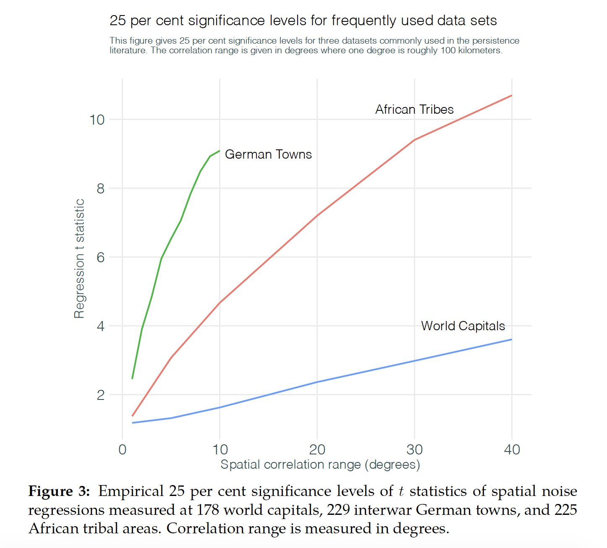
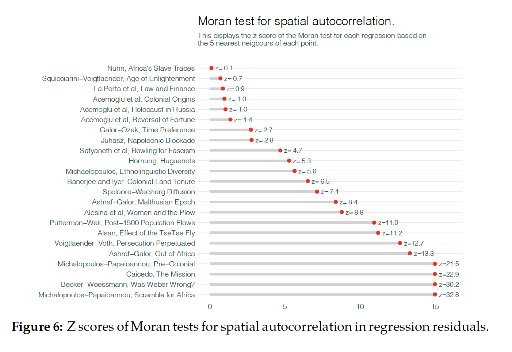
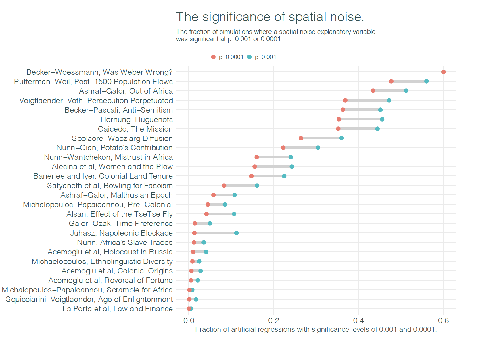

```{r setup, include=FALSE}
options(htmltools.dir.version = FALSE)
library(estimatr)
library(gstat)
library(latticeExtra)
library(sf)
library(spdep)
library(tidyverse)
library(texreg)
knitr::opts_chunk$set(fig.retina = 3)
```

# Take Home Point

Failure to understand and account for spatial autocorrelation creates bias in regressions that could call into question major findings in economics and political science. 

Only 25% of the studies in Kelly's sample have findings that are robust after taking into account possibility regressions are fitting spatial noise. 

---

# Goals of Kelly (2019)

1. Show the connection between high *t*-statistics and severe spatial autocorrelation of residuals

--

2. Apply that finding to the persistence literature 

---

# The setting for these findings

There is Large literature on persistence that suggest modern outcomes (incomes, social attitudes) are shaped by past characteristics 
- Examples:
    - Medieval pograms and votes for Nazi parties Voigtlander and Voth 
    - Slave trade and mistrust in African Societies (Nunn and Wantchekon 2011)
    - Slavery in the American South and contemporary differences in political attitudes (Acharya, Blackwell, Sen 2016)

The persistence variables have high explanatory power (e.g. big *t*-statistics)

---

# The Problem with Space

Tobler's First Law of Geography: "Everything is related to everything else, but near things are more related than distant things."

--
- Persistence regressions are spatial regressions. Like time series, spatial regressions can have correlated values.

--
- Spatial Autocorrelation describes the degree to which observations in spatial locations are similar to each other

---

# Kelly's Test 

Kelly proposes a two step procedure for identification of persistence issues: 

1. Compute a Moran Index. Large Moran Index are "reliable warnings that nominal significance levels differ substantially from true ones".
2. Generate synthetic spatial noise to match correlation structure of variables of interest. Use these as placebo tests.

---

# What the paper is not doing

Checking for issues with data construction 
- e.g. Acemoglu, Robinson, Johnson 2001 (Albouy 2012), La Porta et al 1997 (Spamann 2010)

--

Check plausibility of mechanism or quality of scholarship 

--

Checking for econometric issues

--

Interested in disproving findings of original studies
    
---

# Moran's Statistic

Moran's Statistic or Moran's *I* is a measure of spatial autocorrelation

$$I = \frac{N}{\sum_{i=1}^n \sum_{i=1}^nw_{ij}}\frac{\sum_{i=1}^n\sum_{j=1}^nw_{ij}(x_i -\bar{x})(x_j - \bar{x})}{\sum_{i=1}^n(x_i - \bar{x})^2}$$

- N is the number of spatial weights indexed by *i* and *j* 
- $x$ is the variable of interest. $\bar{x}$ is the mean of $x$. 
- $w_{ij}$ is the spatial weights matrix with zeros on the diagonals

Think of this as the weighted sum of covariance between every pair of residuals with a weight scheme that follows Tobler's First Law of Geography
---

# R Implementation 

[Full Code for R Simulation Setup](https://tinyurl.com/t3xh5zm)

```{r, include = F, results='hide',message = F, warning = F}
set.seed(345)
size <- 100

xy <- expand.grid(1:size, 1:size)%>%
    setNames(c("x", "y"))
g <- gstat::gstat(formula = z~1, 
                  locations = ~x+y, 
                  dummy = T, 
                  beta = 0, 
                  model = vgm(psill = 0.1, 
                              range = 10, 
                              model = "Exp"), 
                  nmax = 20)
yy <- predict(g, newdata = xy, nsim = 2)

# Normalize Data from 0 to 1 
yy <- yy %>% 
  mutate(sim1 = (sim1 - min(sim1))/(max(sim1)- min(sim1)),
         sim2 =  (sim2 - min(sim2))/(max(sim2) - min(sim2)))
sp::gridded(yy) <- ~x + y # will return True to indicate it's a grid 

# Sample Points
# set.seed(123)
samples <- 50 
x <- runif(samples, 0, size) %>%
  floor + 1 # get us to nearest integer 
y <- runif(samples, 0, size)%>%
  floor + 1
dataPoints <- data.frame(x,y)
y1 <- raster::raster(yy["sim1"])
y2 <- raster::raster(yy["sim2"])

plot_data <- data.frame(sim1 = raster::extract(y1, dataPoints), 
                        sim2 = raster::extract(y2, dataPoints))
```

---

# Picture of Two Independent Random Spatial Processes

```{r, echo = F}

# plot grids 
sp::spplot(obj = yy, 
           names.attr = c("Hopscotch Enthusiasts in 1900", 
                          "Berkeley Admit Rate"),
           main = list("An obviously spurious correlation between two Spatial Variables"))+
  latticeExtra::layer(panel.points(x,y, col = "white", pch = 19), data = dataPoints)
```

---

# Correlation in the Noise

Even though by construction there is no relationship, a linear regression reports a negative and statistically significant coefficient

```{r, results = 'asis', echo = F}
s <- estimatr::lm_robust(sim1 ~ sim2, data = plot_data, se= "stata")
out <- summary(lm(sim1 ~ sim2, data = plot_data))
s %>% htmlreg(include.ci=FALSE, custom.coef.names = c("Intercept", "Hopscotch Enthusiasts in 1900"), doctype = F)

```

---

# Visual Inspection of Correlation

The problem is that there is correlation in the residuals due to spatial autocorrelation.

```{r, message = F, warning = F, echo = F, out.height=450}
s <- ggplot(plot_data, aes(sim2, sim1))+
  geom_point()+
  geom_smooth(method ="lm", se = T)+
  theme_light()+
  xlab("Hopscotch Enthusiasts in 1900")+
  ylab("Berkeley Admit Rate")
s
```

---

# Moran's Index for our simulated data

A Moran Monte Carlo test reveals that our observed Moran statistic is highly unlikely to occur if there was no spatial noise. 

```{r, echo = F, out.height=450}
plot_data_sp <- st_as_sf(plot_data %>% cbind(dataPoints), coords = c("x", "y"), crs=NA, agr= "constant")
Wij <- spdep::dnearneigh(plot_data_sp, 0, 20)
dlist <- nbdists(Wij, st_coordinates(plot_data_sp))
ilist <- lapply(dlist, function(x) exp(-x))
lw <- nb2listw(Wij, glist = ilist, style = "W", zero.policy = TRUE)

# Moran test analytically 
#moran.test(plot_data$sim1, lw)

# Moran test MC 
MC <- moran.mc(plot_data$sim1, lw, nsim = 10000)
plot(MC, main = "", las=1)
```

---

# The real world is spatially correlated 


---

# The real world is spatially correlated 



---

# Kelly's Results 

Replicates the leading regression in the paper exactly

--

- Applies two step procedure

--

- Implication: "Only about 1/4 of the persistence results we examine are robust after we take account of possibility that regressions might be fitting spatial noise"

---

# Moran Index for Papers 



---

# The explanatory power of noise 



---

# Actual predictors explain noise 


---

# Concluding remarks

From this sample of papers the papers that have low Moran statistics often use very weak instruments

--

Sample appears to trade off weak data with spatial correlation

--

Few if any actually estimate spatial regressions, even as a robustness check 


